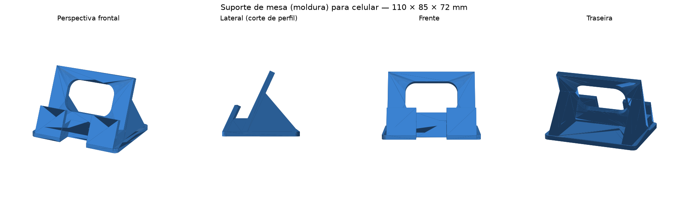

# Suporte de mesa (moldura) para celular — impressão 3D

Peça única, sem encaixes e sem parafusos. Segura o celular em pé na mesa,
em **retrato ou paisagem**, e permite **carregar o aparelho apoiado**.

**Arquivo para imprimir:** [`stl/suporte-celular-moldura.stl`](stl/suporte-celular-moldura.stl)



## Medidas

| | |
|---|---|
| Dimensões externas | 110 × 85 × 72 mm |
| Inclinação do aparelho | 25° em relação à vertical |
| Canal de apoio | 14 mm (serve de ~6 a 13 mm de espessura, com ou sem capinha) |
| Altura do piso acima da mesa | 18 mm |
| Aba de retenção acima do piso | 14 mm |
| Vão central para o cabo | 34 mm de largura × 18 mm de altura, aberto até a frente |
| Volume | 126 cm³ (≈ 55–60 g em PLA com 20% de preenchimento) |

O canal é propositalmente folgado: o celular encosta na moldura e a aba
frontal apenas impede que ele escorregue. Por isso serve para praticamente
qualquer smartphone, com ou sem capinha, sem precisar de medida exata.

Em paisagem o aparelho apoia sobre os 100 mm da aba e sobrepõe as laterais —
é o uso normal e continua estável.

## Configuração de impressão

- **Posição:** como está no STL, apoiado na base. **Sem suportes.**
- **Altura de camada:** 0,2 mm
- **Paredes:** 3 perímetros
- **Preenchimento:** 15–20% (giroide ou grade)
- **Material:** PLA ou PETG. Evite PLA se o suporte ficar em carro ou ao sol.
- **Brim:** não é necessário; a base tem 110 × 85 mm de contato.
- **Tempo estimado:** 4 a 6 h, dependendo da impressora.

O único trecho em ponte é o topo da janela da moldura (36 mm de vão), que
qualquer impressora calibrada faz sem problema.

### Acabamento recomendado

Cole quatro pés de feltro ou um retângulo de EVA sob a base — além de não
riscar a mesa, aumenta o atrito e impede que o conjunto deslize quando você
toca na tela.

## Como foi gerado

O STL foi construído por `gerar_suporte.py` (Python + trimesh + manifold3d).
Você não precisa dele para imprimir — está no repositório apenas como
registro da geometria, caso um dia queira alterar alguma medida:

```bash
pip install trimesh manifold3d shapely mapbox_earcut numpy scipy
python3 gerar_suporte.py
```

Os parâmetros ficam todos no bloco do topo do arquivo (inclinação, folga do
canal, largura, espessuras, tamanho da janela).
